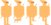

# Universo Primordial | Beta 1.0 Protótipo

### Para jogar

- Clone o repositório para o seu computador.
- Certifique-se de ter o "Node.js", "npm" e suas dependências instalados na sua máquina.
- Faça a instalacão da biblioteca Kaboom.js, utilizando o comando `npm install kaboom`.
- No repositório clonado, clique com o botão direito sobre a pasta "mygame" e selecione a opção "Abrir no terminal integrado".
- No terminal, execute o comando `npm run dev`.
- Copie o último link fornecido, que corresponde à opção "Local", e cole-o na barra de endereço do seu navegador para abrir o jogo.
- Aproveite :D
- Depois de jogar, acesse esse formulário: [Universo Primordial](https://forms.gle/f1VXB2GJS748Qz25A)

## Sobre o jogo
Universo Primordial é um protótipo de jogo desenvolvido em JavaScript, que será posteriormente elaborado na plataforma Unity. Utilizando a biblioteca Kaboom.js, foi possível implementar toda a mecânica do jogo, desde a criação de partes dos cenários até a movimentação, interação e comportamento do jogador principal e dos inimigos.
A estrutura do código é dividida em cenas. Cada cena possui sua própria estrutura de código, responsável por renderizar todas as imagens e lógicas do jogo na tela quando chamada.

## Cenas e elementos

As cenas "tela inicial" e "tutorial" têm a função de exibir uma imagem na tela, orientando o usuário sobre como jogar e o funcionamento do jogo.
A cena "jogo" contém toda a lógica do jogo. O cenário de fundo é uma imagem no formato .png, e as colinas à frente foram construídas dentro da própria cena, permitindo interação com os inimigos. Com exceção das nuvens, todos os elementos móveis obedecem à gravidade, que é definida no início da cena ou globalmente, utilizando uma variável global.
### Tela inicial:

### Adição de elementos e importando imagens:
Todos os elementos são adicionados ao jogo utilizando o método add(). Dentro desse método, são especificados o tamanho do elemento, sua posição na tela, sua massa (quando necessário) e se ele está sujeito à gravidade ou não. Para importar as imagens e personagens no formato .png, utilizamos a função `loadSprite()`, enquanto os efeitos sonoros são importados através da função `loadSound()`.
Para animar o personagem, empregamos a função `loadSprite()`, que percorre toda a imagem, dividindo-a em frames e criando as animações. Esta função nos permite definir o início, o fim, a velocidade e a repetição da animação
### Exemplo:

## Obejetivo e lógica do jogo
O objetivo do jogo é impedir que as ondas de energia sobrecarreguem o estabilizador.
O jogador tem uma velocidade inicial de 400. Cada vez que o personagem entra em contato com os inimigos, ele os absorve, mas perde 10 pontos de velocidade a cada interação. Isso significa que conforme o jogador absorve mais energia, ele é fica mais lento, aumentando a dificuldade do jogo.

Da mesma forma, quando o jogador absorve energia, ele ganha pontos. A cada nova pontuação, é verificada a quantidade total de pontos do jogador. Com isso, a velocidade de surgimento dos inimigos/energias aumenta proporcionalmente, garantindo que o jogador faça mais pontos à medida que avança no jogo. Quando o jogador atinge entre 200 e 600 pontos, a velocidade dos inimigos aumenta em 30%, os itens de vida e velocidade aparecem 10% mais rapidamente, e a pontuação adicional varia entre 5 a 10 pontos a mais.
